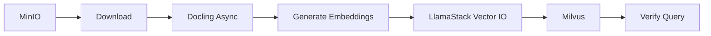

# RAG Ingestion Pipeline - Complete Workflow

**Status:** ✅ Production-Ready (Async Docling)  
**Last Updated:** 2025-11-05

---

## Overview

The RAG ingestion pipeline processes documents through Docling, generates embeddings using IBM Granite, and inserts them into Milvus via LlamaStack's Vector IO API.

**Key Components:**
- **Docling:** Document processing with async API (handles large PDFs)
- **Granite Embeddings:** IBM Granite 125M English model
- **LlamaStack Vector IO:** Unified API for vector database operations
- **Milvus:** Vector database for RAG retrieval

---

## Pipeline Flow



**Steps:**
1. **Download from MinIO:** Retrieve PDF from S3-compatible storage
2. **Process with Docling:** Async conversion to markdown (10min timeout, exponential backoff)
3. **Generate Embeddings:** Split markdown into chunks, embed with Granite
4. **Insert via LlamaStack:** Use `/v1/vector-io/insert` API
5. **Verify:** Query via `/v1/vector-io/query` API

---

## Prerequisites

### 1. Infrastructure Components

All components must be deployed and healthy:

```bash
# Check component status
oc -n private-ai-demo get deployment docling-deployment -o jsonpath='{.status.readyReplicas}'  # Should be > 0
oc -n private-ai-demo get deployment granite-embedding -o jsonpath='{.status.readyReplicas}'   # Should be > 0
oc -n private-ai-demo get deployment llama-stack -o jsonpath='{.status.readyReplicas}'         # Should be > 0
oc -n private-ai-demo get deployment milvus-standalone -o jsonpath='{.status.readyReplicas}'   # Should be > 0
oc -n private-ai-demo get dspa dspa -o jsonpath='{.status.conditions[?(@.type=="Ready")].status}'  # Should be "True"
```

### 2. MinIO Credentials

Pipeline uses `model-storage` tenant credentials:

```bash
# Verify credentials exist
oc -n model-storage get secret minio-credentials -o jsonpath='{.data.accesskey}' | base64 -d
oc -n model-storage get secret minio-credentials -o jsonpath='{.data.secretkey}' | base64 -d
```

### 3. LlamaStack Vector DB Configuration

LlamaStack must have vector databases registered (see `gitops/stage02-model-alignment/llama-stack/configmap.yaml`):

- `rag_documents` (default, used by KFP pipeline)
- `acme_corporate` (ACME corpus, used for RAG queries)
- `red_hat_docs` (Red Hat documentation)
- `eu_ai_act` (EU AI Act regulatory text)

---

## Usage

### Step 1: Upload Document to MinIO

```bash
cd stages/stage2-model-alignment

# Upload a PDF to MinIO
./upload-to-minio.sh ~/path/to/document.pdf s3://llama-files/sample/document.pdf
```

**Supported File Types:**
- PDF (primary)
- Images (PNG, JPG) via Docling OCR

**File Size Recommendations:**
- **< 5MB:** Fast processing (< 1 min)
- **5-20MB:** Normal processing (1-5 min)
- **> 20MB:** Slow processing (5-10 min)

**Note:** Docling async endpoint has a 10-minute timeout for conversion.

### Step 2: Run Pipeline

```bash
# Using default document (rag-mini.pdf)
./upload-and-run.sh

# Using custom document
./upload-and-run.sh s3://llama-files/sample/my-document.pdf
```

**What This Does:**
1. Compiles pipeline with updated defaults
2. Creates a new KFP experiment (if needed)
3. Uploads a new pipeline version
4. Creates and starts a pipeline run
5. Monitors execution until completion

### Step 3: Monitor Pipeline

```bash
# Watch pipeline progress
oc -n private-ai-demo get pods -w

# Check pipeline logs
oc -n private-ai-demo logs -f <pod-name> -c main

# KFP Dashboard
echo "https://$(oc -n private-ai-demo get route ds-pipeline-dspa -o jsonpath='{.spec.host}')"
```

---

## Pipeline Parameters

| Parameter | Default | Description |
|-----------|---------|-------------|
| `input_uri` | `s3://llama-files/sample/rag-mini.pdf` | S3 URI of input document |
| `docling_url` | `http://docling-service.private-ai-demo.svc:5001` | Docling service endpoint |
| `embedding_url` | `http://granite-embedding.private-ai-demo.svc/v1` | Granite embedding service |
| `embedding_model` | `ibm-granite/granite-embedding-125m-english` | Embedding model ID |
| `llamastack_url` | `http://llama-stack-service.private-ai-demo.svc:8321` | LlamaStack API endpoint |
| `vector_db_id` | `rag_documents` | Target Milvus collection |
| `embedding_dimension` | `768` | Granite embedding dimension |
| `chunk_size` | `512` | Text chunk size (characters) |
| `minio_endpoint` | `minio.model-storage.svc:9000` | MinIO endpoint |
| `aws_access_key_id` | (from secret) | MinIO access key |
| `aws_secret_access_key` | (from secret) | MinIO secret key |
| `min_chunks` | `10` | Minimum chunks for verification |

---

## Validation

### 1. Verify Data in Milvus

```bash
# Check collection exists
oc -n private-ai-demo exec deploy/milvus-standalone -- python3 -c "
from pymilvus import connections, utility
connections.connect(host='127.0.0.1', port='19530')
print(utility.list_collections())
"

# Count entities
oc -n private-ai-demo exec deploy/milvus-standalone -- python3 -c "
from pymilvus import connections, Collection
connections.connect(host='127.0.0.1', port='19530')
col = Collection('rag_documents')
print(f'Entities: {col.num_entities}')
"
```

### 2. Test via LlamaStack API

```bash
# Query via Vector IO API
oc exec -n private-ai-demo deploy/llama-stack -- curl -X POST \
  http://localhost:8321/v1/vector-io/query \
  -H "Content-Type: application/json" \
  -d '{
    "vector_db_id": "rag_documents",
    "query": "test query",
    "params": {"top_k": 3}
  }'
```

### 3. Test in LlamaStack Playground

```bash
# Get Playground URL
echo "https://$(oc -n private-ai-demo get route llama-stack-playground -o jsonpath='{.spec.host}')"
```

**Test Queries:**
- "What are ACME quality standards?"
- "Tell me about ACME compliance requirements"
- "How does ACME document control work?"

---

## Troubleshooting

### Issue: Docling Timeout

**Symptoms:**
- Pipeline fails at `process-with-docling` step
- Error: `TimeoutError: Docling conversion timed out after 600s`

**Solutions:**
1. Use a smaller/simpler PDF
2. Increase timeout in `pipeline.py` (line 115: `max_wait = 600`)
3. Check Docling pod logs for errors

### Issue: Empty Results from Milvus

**Symptoms:**
- Pipeline completes successfully
- Query returns 0 chunks

**Solutions:**
1. Verify collection exists: `oc exec deploy/milvus-standalone -- python3 -c "from pymilvus import connections, utility; connections.connect(); print(utility.list_collections())"`
2. Check LlamaStack config: `oc get cm llamastack-config -o yaml | grep -A 10 vector_dbs`
3. Verify `provider_vector_db_id` matches actual Milvus collection name

### Issue: MinIO Upload Permission Denied

**Symptoms:**
- `upload-to-minio.sh` fails with "Access Denied"

**Solutions:**
1. Verify credentials: `oc -n model-storage get secret minio-credentials -o yaml`
2. Check bucket exists: `oc run mc-test --rm -i --restart=Never --image=quay.io/minio/mc -- mc alias set minio http://minio.model-storage.svc:9000 <key> <secret> && mc ls minio`
3. Ensure using `model-storage` tenant credentials, not DSPA credentials

### Issue: KFP API Parameter Type Error

**Symptoms:**
- Pipeline creation fails with "input parameter requires type string, but the input parameter is not of string value type"

**Solutions:**
1. This is a known KFP v2beta1 bug
2. Use the provided helper scripts which use v1beta1 API for run creation
3. All parameters are passed as strings per DSPO guidance

---

## Architecture Alignment

### Red Hat Best Practices ✅

- **Async Docling API:** Reliable processing for large documents
- **LlamaStack Vector IO:** Unified API layer per RHOAI 2.25 guidance
- **v2beta1/v1beta1 API Mix:** Pipelines via v2beta1, runs via v1beta1 (workaround for parameter bug)
- **Internal Service URLs:** All inter-service communication uses cluster DNS
- **Operator-Managed Components:** Docling via `docling-operator`, LlamaStack via `llamastack-operator`

### GitOps Integration ✅

All infrastructure is declarative:

```
gitops/stage02-model-alignment/
├── docling/                     # Docling operator CR
├── granite-embedding/            # Custom embedding service
├── llama-stack/                 # LlamaStack distribution + config
├── llama-stack-playground/      # Web UI
├── milvus/                      # Vector database
└── dspa/                        # KFP v2 environment
```

---

## Files Reference

**Scripts:**
- `stages/stage2-model-alignment/upload-to-minio.sh` - Upload documents to MinIO
- `stages/stage2-model-alignment/upload-and-run.sh` - Run pipeline
- `stages/stage2-model-alignment/kfp/kfp-api-helpers.sh` - KFP API utilities

**Pipeline:**
- `stages/stage2-model-alignment/kfp/pipeline.py` - Pipeline definition
- `artifacts/docling-rag-pipeline-ascii.yaml` - Compiled pipeline YAML

**GitOps:**
- `gitops/stage02-model-alignment/` - All infrastructure manifests

**Documentation:**
- `docs/02-PIPELINES/RAG-PIPELINE-WORKFLOW.md` (this file)
- `stages/stage2-model-alignment/RUN-PIPELINE.md` - Quick start guide

---

## Next Steps

1. **Production Data:** Upload real ACME corporate documents
2. **RAG Agent:** Test end-to-end RAG queries in Playground
3. **Additional Corpora:** Ingest Red Hat docs and EU AI Act
4. **Monitoring:** Add KFP pipeline metrics and alerts
5. **Optimization:** Tune chunk size and embedding batch size

---

## Related Documentation

- [LlamaStack Configuration](../03-RAG/LLAMASTACK-CONFIG.md)
- [Milvus Setup](../03-RAG/MILVUS-SETUP.md)
- [Docling Operator](https://github.com/docling-project/docling-operator)
- [KFP API v2beta1/v1beta1 Pattern](./KFP-API-PATTERN.md)

